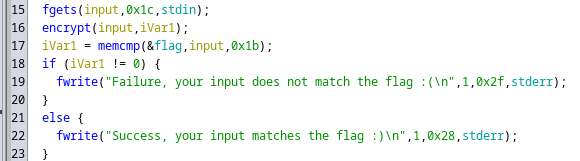
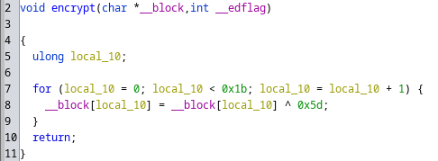

# Floating Viking Head

| Difficulty | Points |
| ---------- | ------ |
| Easy       | 500    |


## Description

> Greetings, mere mortal! Are you ready to embark on a journey to unveil the
> flag and gain the wisdom of the floating Viking head? Harness the power of
> the oracle's gaze and use his words to guide you towards victory.

Files:

```
FloatingVikingHead: ELF 64-bit LSB pie executable, x86-64, version 1 (SYSV),
dynamically linked, interpreter /lib64/ld-linux-x86-64.so.2,
BuildID[sha1]=5608b8f3df4dfd577212fbc8556e8562e15f4c50, for GNU/Linux 4.4.0,
not stripped
```

## Approach

First we ran the binary:

```
$ ./FloatingVikingHead
     _.-._
   .' | | `.
  /   | |   \
 |    | |    |
 |____|_|____|
 |____(_)____|
 /|(o)| |(o)|\
//|   | |   |\\
'/|  (|_|)  |\`
 //.///|\\\.\\
 /////---\\\\\
 ////|||||\\\\
 '//|||||||\\`
   '|||||||`

I am the flag oracle.
Enter a flag and I will tell you if it is correct.
Flag: 
```

Next we used `ghidra` to disassemble the binary and started tracing the
program. We started by looking at the list of functions in the Symbol Tree, and
opening the `main` function. After making sense of the decompiled code by
renaming some of the randomly generated variable names, we find the important
part:



Essentially, the string inputted by the user is stored in the variable named
`input`, it is then encrypted with a call to `encrypt`, and lastly `0x1b` (or
in decimal: 27) bytes from the memory address of the input string and 27 bytes
from the address of the global variable are compared by `memcmp`. If they are
identical, then it will print a message of success, otherwise failure. This
means that the global variable (we renamed to `flag`) points to the flag. We
highlight the 27 bytes from that address, right click and select `Copy
Special...` -> `Python List`.

The flag is encrypted by the `encrypt` function:



This is simple [XOR-cipher](https://en.wikipedia.org/wiki/XOR_cipher) with a
key of `0x5d`, and since a XOR-cipher is a [reciprocal
cipher](https://en.wikipedia.org/wiki/Symmetric-key_algorithm#Reciprocal_cipher)
we can decrypt our flag (that we copied from `ghidra` as a Python List) by
repeating the encryption process on the encrypted flag, with the following
Python script:

```py
#!/usr/bin/python3

enc_flag = [0x2b, 0x34, 0x36, 0x38, 0x1e, 0x09, 0x1b, 0x26, 0x33, 0x6d, 0x02,
0x68, 0x6a, 0x0f, 0x6c, 0x33, 0x64, 0x68, 0x02, 0x1b, 0x6d, 0x2f, 0x02, 0x04,
0x6d, 0x28, 0x20]
# repeat the same XOR-cipher from the encrypt function to get the flag
key = 0x5d
flag = "".join([chr(x ^ key) for x in enc_flag])
print(flag)
```

Flag:

```
vikeCTF{n0_57R1n95_F0r_Y0u}
```
